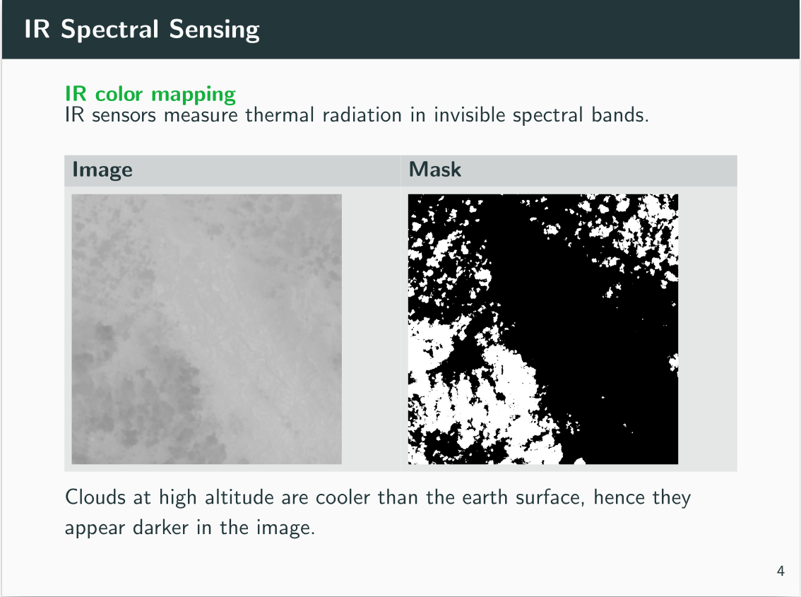
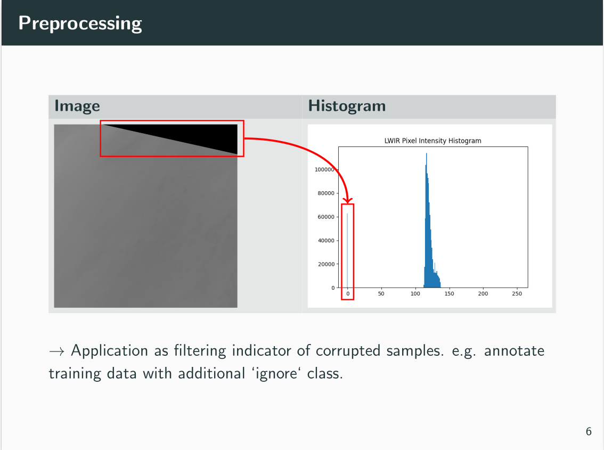
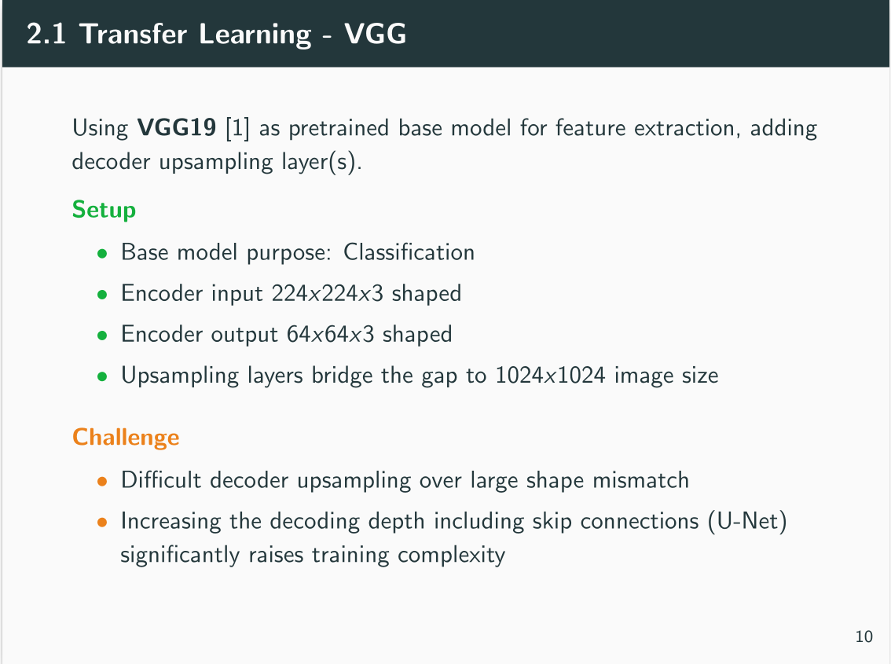
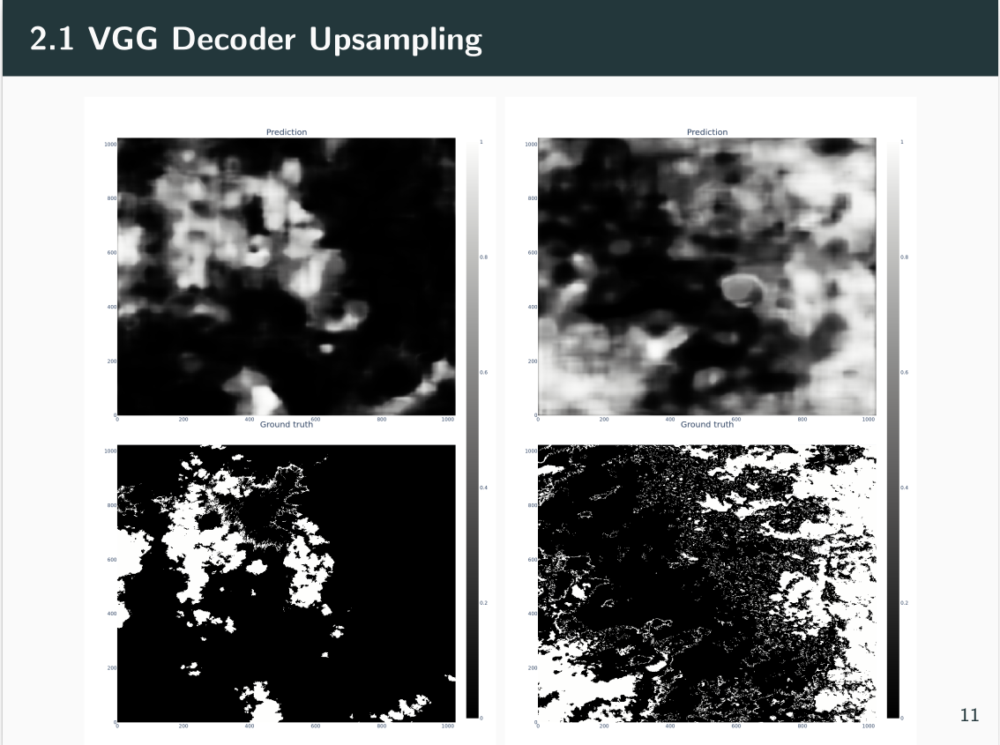
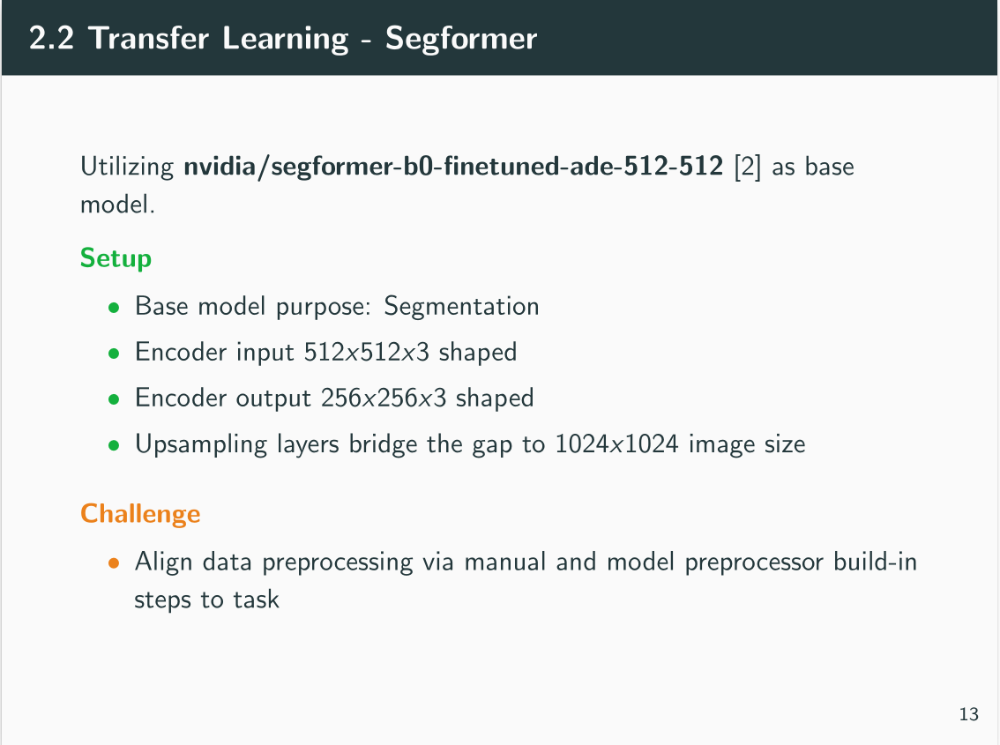
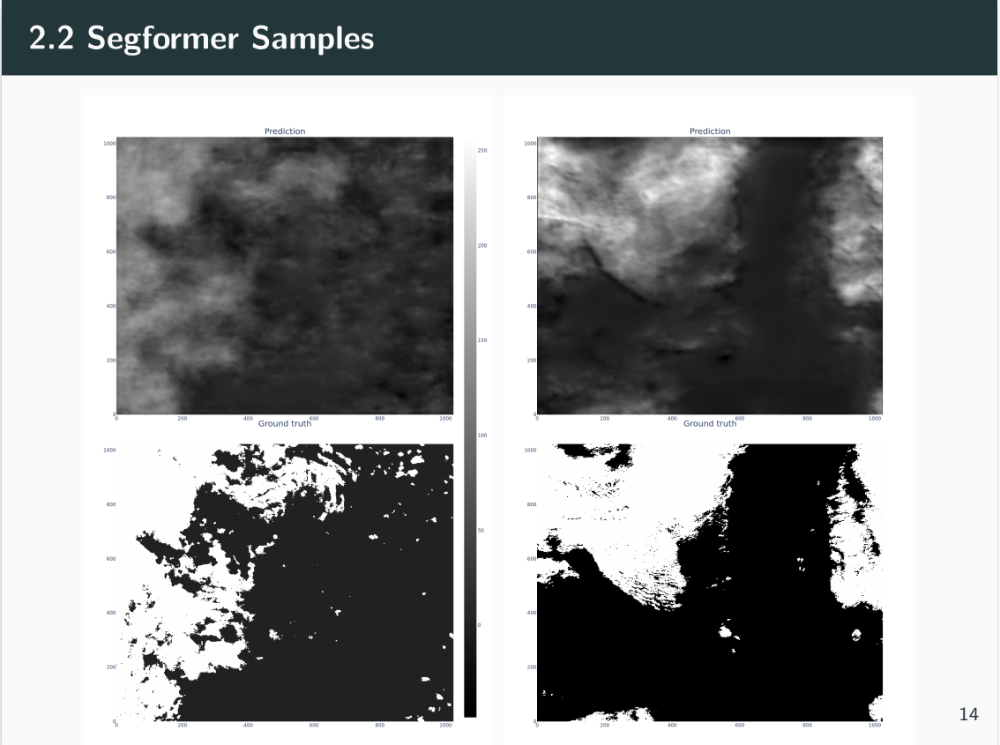
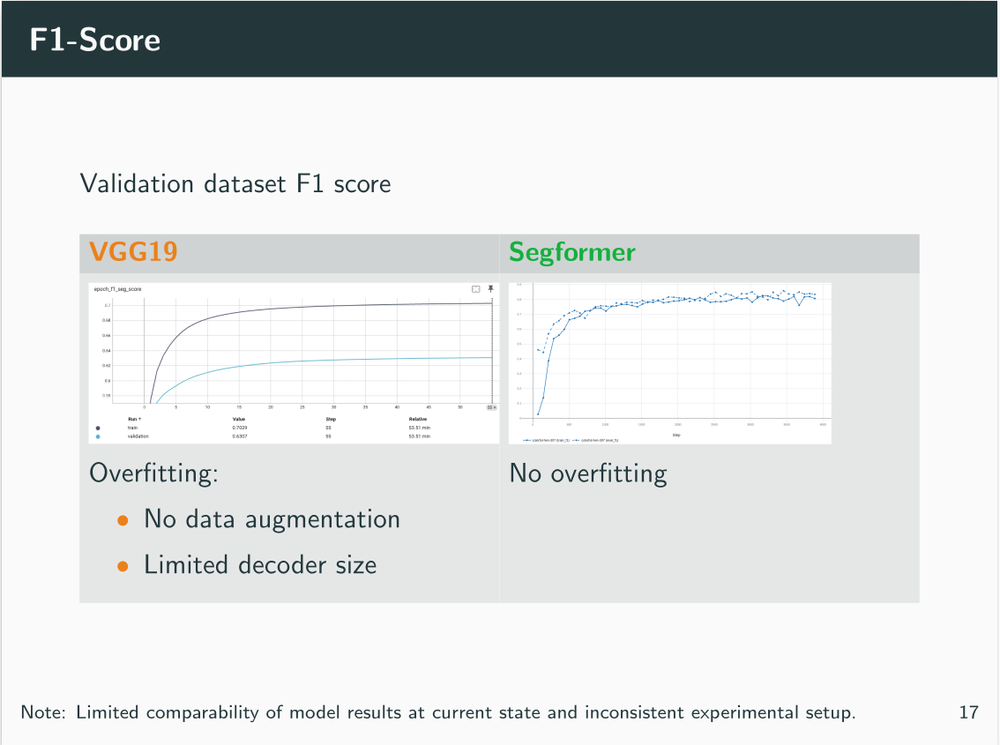

# LWIR cloud image segmentation 

Segment clouds in satellite infrared single channel images.

## Approach 

Supervised training of a model to learn the segmentation mask as a target labels (Y) from the satellite images (X).

## Data set 

Pairs of IR (single channel) images and binary masks for supervised learning. 

- Image/mask size: 1024x1024x1 
- Approx. 1000 samples 

### Data preprocessing 

- TIFF image format 
- Adaption to multi channel base model, by replicating gray scale input image to 3 channels 
- Augmentations (rotation, flip, noise, cropping)

## Models

Transfer learning for image semantic segmentation tasks

### (CNN) VGG19 

Location: <code>/tensorflow_vgg/</code>

(static preprocessed TFRecord dataset, no augmentation)

- Flat (one step) upsampling decoder -> easy to train but overfits
- Deeper decoder increases training challenge

### (ViT) Segformer 
Location: <code>/pytorch_segformer/</code>

- Two step upsampling decoder

### Training 

